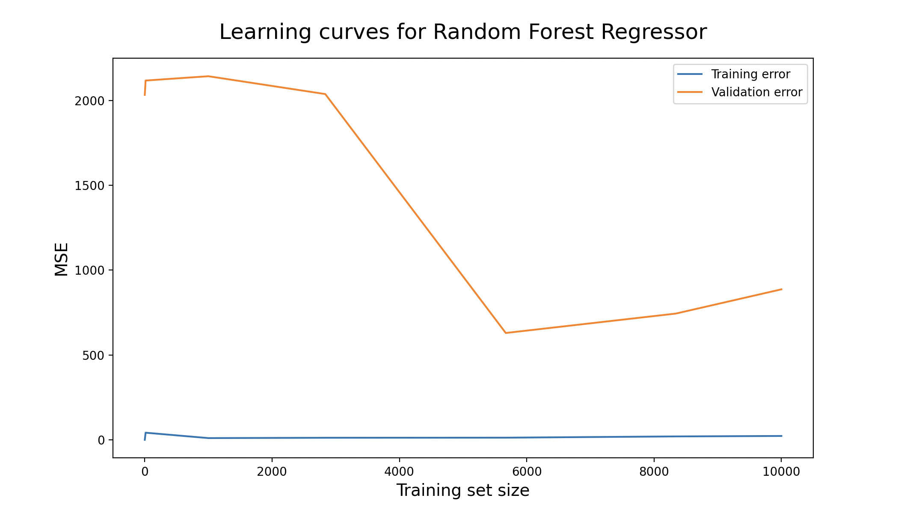
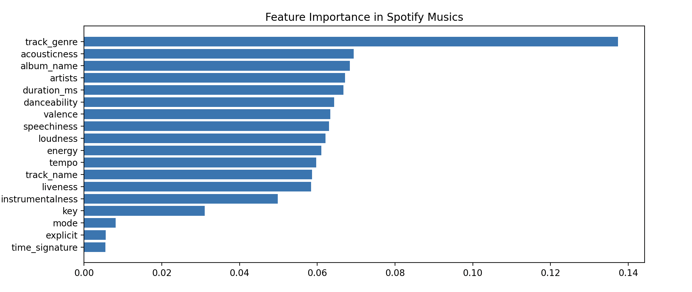
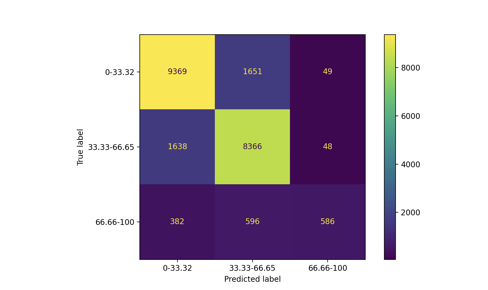
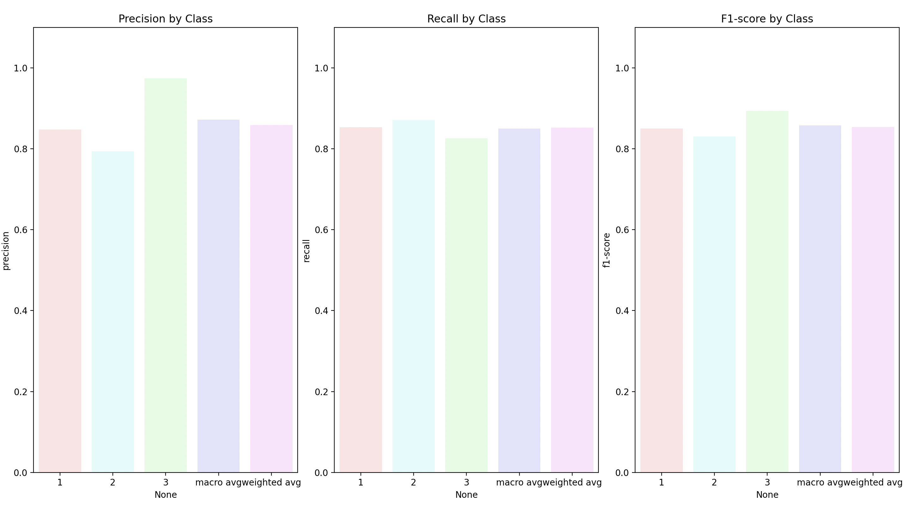
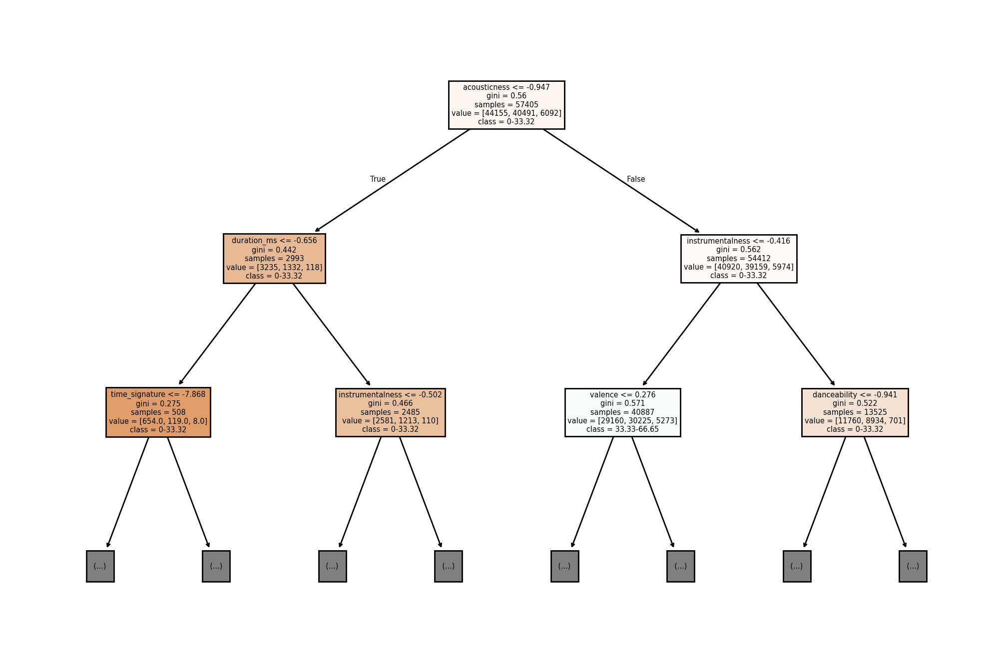

# Song Popularity Prediction with Machine Learning

A personal investigation into predicting Spotify song popularity from audio and
metadata features using Random Forest models, and analyzing which features drive
popularity.

Author: Yusen (Eason) Li

## Overview

Using a public dataset of 114,000 Spotify tracks, this project builds two models:

- **Random Forest Regressor (RFR)** — predicts a song's exact popularity score (0–100).
- **Random Forest Classifier (RFC)** — predicts a popularity *tier* (Low: 0–33.32,
  Medium: 33.33–66.65, High: 66.66–100).

Both models double as feature-importance tools: beyond prediction, they reveal which
audio/metadata features (genre, acousticness, album name, etc.) most strongly influence
a song's popularity.

**Dataset:** [114k Spotify Songs](https://www.kaggle.com/datasets/priyamchoksi/spotify-dataset-114k-songs)
by Priyam Choksi (Kaggle). See [`data/README.md`](data/README.md) for how to obtain it.

## Results

**Regressor:** R² = 0.603, MSE = 195.678. The learning curve shows validation error
converging early, suggesting the available features have limited linear correlation
with the exact popularity score.

| Learning Curve | Feature Importance |
|---|---|
|  |  |

**Classifier:** 0.81 weighted accuracy on the raw class distribution; 0.853 accuracy
after balancing the three popularity classes, which also improved precision/recall on
the minority (High popularity) class from 0.86/0.37 to 0.97/0.83.

| Confusion Matrix (before balancing) | Precision / Recall / F1 (after balancing) |
|---|---|
|  |  |

*(These two figures are from different runs — the confusion matrix shows the original
class distribution described above; the per-class metrics show the improved, balanced
result. Re-run `src/train_classifier.py` to regenerate both from a single run.)*

A sample decision tree from the Random Forest Classifier, showing how splits on
features like `acousticness` and `instrumentalness` separate popularity tiers:



**Key finding:** `track_genre` and `album_name` are consistently the most important
features for predicting popularity — genre reflects listener taste, and album name
shapes a listener's first impression before they've heard the track.

## Repository Structure

```
├── src/
│   ├── data_preparation.py      # Load, clean, and scale the raw dataset
│   ├── feature_engineering.py   # Train/test split
│   ├── train_regressor.py       # Train and evaluate the Random Forest Regressor
│   └── train_classifier.py      # Train and evaluate the Random Forest Classifier
├── experiments/                 # Earlier iterations, kept for reference (see below)
├── data/
│   └── README.md                # Dataset source and setup instructions
├── results/                     # Output figures referenced above
└── requirements.txt
```

### `experiments/`

Earlier iterations of the classifier/regressor kept to show the actual research
process — trying different class-boundary schemes, tree counts, and correlation
checks before converging on the final approach in `src/`. These are left close to
their original form (including commented-out attempts) rather than cleaned up:

- `RandomForestModelTest.py`, `RandomForestClassifierTest.py` — early exploration:
  correlation heatmap, first classifier pass with a simple 2-class split
- `RandomForestClassifierWithString.py` — mid-iteration classifier, testing different
  numbers of tiers (2, 3, and 4-class attempts appear commented out)
- `RandomForestRegressorWithString.py` — regressor variant experimenting with
  under-sampling by popularity tier before regression

## Methodology (summary)

1. **Data preparation:** dropped rows with missing values (114,000 → 113,423 songs);
   applied `StandardScaler` to numeric features and `LabelEncoder` to categorical ones
   (artist, album, track name, genre).
2. **Feature engineering:** 80/20 train/test split.
3. **Modeling:** Random Forest for both regression (exact score) and classification
   (popularity tier), chosen for its ability to rank feature importance and handle
   nonlinear relationships without heavy preprocessing.
4. **Evaluation:** MSE/R² and learning curves for the regressor; confusion matrix and
   per-class precision/recall/F1 for the classifier, including a class-balancing pass
   to correct for the underrepresented "High popularity" tier.

## Setup

```bash
pip install -r requirements.txt
python src/data_preparation.py
python src/feature_engineering.py
python src/train_regressor.py
```
